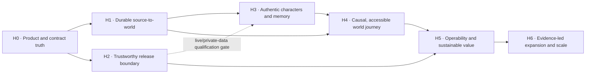

# NovelWorld Long-Term Roadmap

This roadmap works backward from the product promised in [`README.md`](../README.md):
a reader turns a supported novel into a world, talks to source-grounded
characters, changes that world as their own player, and returns to the same
memory and causal history later.

It orders outcomes by dependency and evidence, not by calendar or feature
count. Current architecture is evidence, not destiny. A queue, object store,
new database, orchestrator, or additional service is never a roadmap outcome by
itself.

## Authority and decision rules

| Question | Source of truth |
|---|---|
| What product are we trying to create? | [`README.md`](../README.md), limited to claims backed by the supported envelope |
| What is supported now, and who owns each responsibility? | [`PRODUCT_CONTRACT.md`](./PRODUCT_CONTRACT.md) |
| What behavior is required? | The approved version of [`SPEC.md`](../SPEC.md) |
| What is each reviewed SPEC clause's evidence state? | [`SPEC_CONFORMANCE.md`](./SPEC_CONFORMANCE.md) |
| What does the system do today? | Runtime code, migrations, and tests; documentation is not runtime evidence |
| What engineering constraints apply today? | [`AGENTS.md`](../AGENTS.md) and accepted architecture decisions until explicitly superseded |
| What outcome comes next? | This roadmap |
| What thresholds gate a release? | Versioned SLO, quality, security, and cost policies approved in a separate reviewed change before the candidate is judged |
| What defines the initial slices and threshold process? | [`QUALIFICATION_POLICY.md`](./QUALIFICATION_POLICY.md) |
| What is being executed now? | [GitHub Project](https://github.com/users/schorsch888/projects/2) and one independently mergeable roadmap issue |

When these disagree, do not silently implement the document or rewrite history.
Record the conflict, decide the intended contract, then change the specification
and implementation together. `SPEC.md` is a contract, not proof of compliance.

## North-star outcome

A **successful durable world journey** means that an eligible reader can:

1. import a novel inside the declared support envelope without manual
   annotation;
2. receive a source-cited canonical model or a bounded, recoverable failure;
3. complete a character conversation grounded in that character, the readable
   source, committed memories, and the current world timeline;
4. in the primary self/open-world mode, commit a player action that can change
   causality without controlling a canonical character;
5. retry, disconnect, restart, and upgrade without losing, duplicating, leaking,
   or silently rewriting authoritative state;
6. export the in-scope state completely and verifiably, and delete it without
   later resurrection or disclosure beyond the documented backup/provider
   boundary.

The long-term scorecard measures user outcomes, not endpoint count:

- eligible journey completion and recoverable-import rates;
- cross-session world-continuity and return-to-world rates;
- source coverage, character fidelity, memory relevance, causal coherence, and
  spoiler-safety by supported slice;
- first-token, durable-commit, resume, and recovery SLIs;
- privacy/security guardrails; cost per attempt and per successful operation;
  failed/retried work, provider fan-out, and per-principal/time-window spend.

Definitions, denominators, hard guardrails, and decision rules live in
versioned policies and are frozen before baselining. An instrumentation-only
change may establish a missing baseline; its target thresholds must then be
approved in a separate review before the implementation it judges can pass.
Neither thresholds nor the supported language/format/provider/model slices may
be weakened in the judged change merely to make it pass. Product telemetry must
be locally aggregated or collected with explicit consent and must not contain
novel text, prompts, conversations, identities, or secrets.

## Non-negotiable invariants

These derive from the README outcome, the approved `SPEC.md`, and production
safety constraints, and remain true across every architecture:

1. **Identity and ownership:** acting identity comes only from Gateway-verified
   authentication. Novels, characters, conversations, memories, timelines,
   exports, and deletion remain reader-isolated (§9, §10.8, §15).
2. **Immutable canon:** source text and source-backed canon are immutable.
   Generated events and prose are player-scoped overlays with provenance; they
   never silently become canon (§7.4–§7.6).
3. **Untrusted models:** model input and output cannot authorize an operation or
   establish a fact. Only bounded, schema-valid, entity-valid, hard-rule-valid,
   spoiler-bounded transitions may commit (§7.6, §15).
4. **Player agency:** in the primary self/open-world mode, the player controls
   only their `PlayerEntity`; canonical characters retain their own goals,
   knowledge, and actions. H0 decides whether optional character-identity mode
   changes only perspective or also defines a separate bounded agency model. It
   cannot silently bypass ownership, the same-character conversation
   restriction, canon/spoiler rules, or its declared agency boundary (§7.6,
   §8).
5. **Server-owned spoiler boundary:** only persisted reading progress limits
   source knowledge. The browser and model cannot advance it (§6.1, §7.6).
6. **Commit before completion:** chat, narrative choice, and world-turn success
   is emitted only after the full authoritative transaction commits. A completed
   idempotency key replays without another provider call (§6.5, §7).
7. **Durable authority:** each aggregate has one durable authoritative
   representation and, where replay or audit is required, a committed journal
   retained within the owner's approved lifecycle. Caches, search indexes,
   derived media, and generated prose are non-authoritative projections with
   an explicit reconstruction or loss contract. PostgreSQL currently owns this
   boundary (§6.5, §7.6).
8. **Data lifecycle:** every new user-content, identity, or linkable persistent
   data type defines retention, export, deletion, provider exposure, and backup
   behavior before release (§10.8, §15).
9. **Evidence-bounded support:** no language, format, provider, model, quality,
   reliability, or scale claim exceeds version-matched live and adversarial
   evidence.
10. **Usable failure:** accessibility, clear failure state, retry, and recovery
    are part of the core journey, not optional polish (§13). Cancellation is a
    product contract H0 may add, not a presumed implementation requirement.

## Evidence model

| State | Required evidence | What it does not prove |
|---|---|---|
| Proposed | Current truth, intended outcome, invariants, acceptance policy, dependencies, and rollback reviewed | That the design works |
| Landed | Final commit merged with required CI and independent implementation review | Live model quality, deployment, SLO attainment, or user value |
| Release-qualified | Representative live-provider, adversarial, migration, recovery, security, quality, and cost gates required by the change pass on the final commit | That an operator deployed it |
| Deployed | Immutable artifact identity and configuration are recorded and post-deploy checks pass | That it remains reliable or valuable over time |
| Observed | The versioned SLO/quality/cost window and product guardrails pass in the target environment | Universal scale or support outside that envelope |

Each horizon states the highest evidence it requires. A merged PR is never by
itself evidence that a product or operational horizon is complete.

## Current truth that changes the plan

The first review found product-critical gaps beyond the prior storage/avatar
list:

| Promise or contract | Current evidence | Owning horizon |
|---|---|---|
| Character personality and voice drive chat | Novel service stores persona fields; the Agent boundary now carries source-backed persona (aliases, role, description, personality, background, speaking style) into the system prompt as truncated, JSON-quoted data ([PR #143](https://github.com/Wisdoverse/novelworld/pull/143)). Recorded limits: quoting is syntactic-only inertness (not a semantic injection guarantee), and persona is whole-novel extraction not spoiler-bounded by reading progress; goals/relationships still deferred; live quality remains unqualified | H3 |
| Four-layer memory provides cross-session continuity | Mid-term summaries exist and now promote into the long-term layer with 1536-dim embeddings on the production projection path ([PR #145](https://github.com/Wisdoverse/novelworld/pull/145)); promotion is unselective (every mid summary), generation failure or non-1536 provider vectors skip it, evidence is deterministic tests — not live semantic quality; permanent-memory writing is now connected to the journey: each committed open-world turn records a permanent memory (idempotent by turn id, anchored to the protagonist, checkpoint-chapter context) via [PR #147](https://github.com/Wisdoverse/novelworld/pull/147); zero-protagonist novels and embedding failures skip the write | H0 decides the contract; H3 proves the outcome |
| “Any language” interactive world | Ingestion accepts multiple document types, while narrative-node and generated-world paths require Simplified Chinese | H0 defines support; H4 verifies it |
| Reader may assume a canonical character's identity | README and SPEC §8 retain an optional `character` perspective while SPEC §7.6 makes an original `PlayerEntity` the primary open-world actor | H0 resolves the contract; H4 verifies any retained mode |
| One-click import survives interruption | Accepted imports atomically persist chapters plus a staged attempt/lease job and reclaim pending or expired work ([PR #116](https://github.com/schorsch888/novelworld/pull/116)); with retention enabled, imports accept at the `source` stage and replay the retained object before any provider call ([PR #126](https://github.com/schorsch888/novelworld/pull/126)); live kill/restart drills at the `chapters` and `enriched` boundaries pass in CI ([PR #128](https://github.com/schorsch888/novelworld/pull/128)); the S3 `source`-boundary drill passes locally and in required CI ([PR #135](https://github.com/Wisdoverse/novelworld/pull/135)); provider calls stay inside the approved budget ([PR #131](https://github.com/schorsch888/novelworld/pull/131)) | H1 |
| `SPEC.md` storage, avatar, and node algorithms describe runtime | Original-file persistence is opt-in S3 without a resume/reprocessing path; provider image URLs are stored directly; avatar generation is capped; nodes are sampled then generated lazily | H0 decides outcomes rather than blindly implementing algorithms |
| Production data can be recovered | The approved `backup-restore-v2` policy is implemented: encrypted integrity-checked artifacts, erasure-record replay, lineage-token continuation, and backup → erase → restore, deletion-resurrection, and disaster-gate drills pass in CI ([#118](https://github.com/schorsch888/novelworld/issues/118)); the recorded ≥5 GB RTO scale rehearsal and H5 restore game days remain open | H1 and H5 |
| Quality and scale were completed | Current quality evidence is mostly recorded synthetic data; capacity evidence is a test-only single-node profile | H3–H6 |
| Internet-hosted operation is ready | Threat modeling is strong, but deployment mode, rights/content policy, provider disclosure, TLS/session/CORS posture, abuse economics, and release provenance still need explicit gates | H2 |

## Review protocol

Every horizon exit has at least three recorded perspectives. Each record names
the reviewer, commit, evidence, unresolved risks, and disposition. A
fresh-context review agent may supply adversarial evidence, but it does not
replace accountable maintainer approval or an independent human reviewer when
policy requires one; the implementer cannot be the only approving person.

1. **Current-truth review — before planning.** Reconstruct the user outcome,
   current runtime, hard constraints, dependencies, and non-goals from evidence.
   Challenge inherited issue titles, architecture, and speculative scope.
2. **Contract and design review — before implementation.** A non-author checks
   state transitions, ownership, canon/timeline semantics, compatibility,
   migration, retention/export/deletion, observability, rollout, and rollback.
3. **Adversarial review — before merge.** A fresh reviewer attempts to falsify
   the acceptance claim through forged identity, cross-user access, hostile
   novel/prompt/provider output, future spoilers, malformed data, disconnects,
   process death, retries, reordering, dependency failure, deletion races,
   resource exhaustion, or cost amplification. It leaves at least one runnable
   negative check or links an existing check that already exercises the risk.
4. **Final-evidence review — final commit.** An independent reviewer verifies
   required CI, live evaluation where applicable, fault injection, migration,
   restore/rollback, artifact identity, and the exact acceptance policy. Branch
   results and recorded fixtures cannot stand in for required final evidence.
5. **Post-release review — when deployment is in scope.** Canary and observation
   evidence are compared with SLO, quality, security, and cost policies; breach
   of an error budget pauses unrelated rollout until recovery or an explicit
   risk decision.

Review weight is proportional to risk. A documentation-only change may reuse
existing adversarial evidence. Authentication, authorization, persistent state,
migrations, deletion, backup/restore, model commit boundaries, privacy, and the
release workflow require separate contract/design and adversarial reviewers.
When independent human review is unavailable, record the limitation and
explicit risk acceptance; do not label an agent review as human sign-off.

## Dependency map

H1 and H2 may proceed in parallel after their relevant H0 contracts are
approved. H3's local structural implementation may start after H0 and H1; live
or private-data evaluation waits only for the relevant H2 provider, privacy,
and corpus controls, not every supply-chain control. A bounded public canary is
blocked until H1, all of H2, and every exposed product path are
**Release-qualified**. Public general availability is blocked until H5 is
**Observed**. H6 has no start date: it begins only when demand or a named
objective supplies its trigger.

## H0 — Product and contract truth

**Outcome:** every README core promise and release-relevant SPEC requirement is
intentional, testable, owned, and honest about its evidence. This is the next
horizon; later work starts only after its relevant H0 contract is approved.

Scope:

- Decide the initial deployment and responsibility boundary: private
  self-hosting, public hosted service, or separately supported profiles.
- Define the supported envelope for language, format, size, provider/model,
  platform, and accessibility. “Any novel” and “any language” remain aspiration
  until their slices qualify.
- Decide rights attestation, provider data disclosure/consent, retention,
  complaints/takedown, content safety, abuse, and minor-user responsibility for
  each deployment profile. Public hosting requires an appropriate policy and
  legal review; private self-hosting may assign explicit duties to the operator.
- Inventory every README core claim and normative `MUST`/`MUST NOT` statement.
  Fully resolve those that affect the supported envelope, exposed runtime,
  trust or persistence boundary, or next implementation slice as `verified`,
  `intended gap`, `obsolete/correct`, or `aspirational`, with evidence or a
  decision record. Every retained or intended claim maps to a concrete owning
  horizon and acceptance gate; otherwise change README and SPEC together.
  Assign unrelated draft clauses to their owning horizon instead of blocking
  known safety work.
- Resolve internal contradictions before implementation, including draft-spec
  authority, EPUB acceptance, permanent-memory deletion, the source-retention
  and reprocessing contract, avatars, narrative-node timing, prompt-injection
  guarantees, and active-doc drift.
- Version and approve the specification and its change process. Freeze the
  journey, quality, SLO, security, and cost measurement contracts, hard
  guardrails, and threshold-approval rules. Where evidence is missing, schedule
  a baseline-only change instead of inventing a target.
- Provide one clean-checkout verification entry point (`make verify`) that
  verifies and dispatches the same required CI workflow for the exact pushed
  SHA from version-controlled configuration.

Exit evidence:

- 100% of README core claims and release-blocking normative statements have one
  ledger state, owner, evidence/decision link, and—when retained—an owning
  horizon with acceptance criteria. Remaining draft clauses are visibly
  unapproved and assigned to an owning horizon; no contradiction relevant to
  H1 or H2 is hidden.
- README, approved SPEC version, architecture, deployment, retention, security,
  and runtime contracts agree on the supported envelope and current behavior.
- Initial evaluation and journey policies contain normal and adversarial slices
  for every independent supported dimension; risky combinations are selected
  by review rather than a full language × format × provider Cartesian product.
- Current-truth, contract, and independent adversarial overclaim reviews pass.
- A clean checkout verifies and dispatches the same required CI workflow for
  the exact pushed SHA through the documented `make verify` entry point, and
  the successful run URL is recorded.
- Required CI is green on the final commit. Evidence state: **Landed**.

Primary SPEC focus: all normative sections, especially §1–§3, §5–§8, §13, and
§15.

## H1 — Durable source-to-world and data recovery

**Outcome:** a valid source inside a supported slice becomes a useful,
source-cited world at the approved success and quality levels. Invalid or
unsupported input fails clearly and recoverably. Interruption never creates
false readiness, duplicate authoritative output, or unrecoverable state;
ambiguous external-provider work is bounded rather than promised exactly once.

Scope:

- Persist import job identity, stage, attempt, lease, and terminal state, plus
  cancellation only if H0 retains it as a user contract. Safely claim/resume
  work after process death. A database job record may be sufficient; a new
  queue is not presumed.
- Make each ingestion stage's authoritative effects idempotent and bounded.
  Retrying cannot duplicate committed chapters, canon facts, characters,
  relationships, nodes, or derived media. Reuse provider idempotency keys when
  the provider offers that contract; otherwise bound, meter, and budget the
  crash window where receipt is unknowable instead of claiming exactly-once
  external calls.
- Use the retained source object, when enabled, as the input to resumed or
  replayed ingestion. For deployments without object storage, make re-upload
  and failure semantics explicit. Do not add another storage abstraction or
  treat persistence alone as a durable import job.
- Require valid chapter provenance for accepted canon facts and make
  uncertainty visible rather than silently promoting it to canon.
- Define non-vacuous extraction gates for each supported positive slice:
  import success, expected character/relationship/event/world-rule coverage,
  precision and hallucination, chronology/causality, and provenance. Label
  malformed and unsupported cases separately so rejecting every input or
  producing an empty canon cannot pass.
- Define versioned RPO/RTO, encrypted backup/retention policy, integrity checks,
  fresh-host restore, and backup-aware deletion behavior for authoritative data.
  Restoration of a backup predating an account/novel deletion must replay a
  durable erasure record; it cannot silently resurrect visible user data. A
  disaster restore whose newest durable erasure source predates the failure
  refuses to complete by default and may continue only through
  attest-or-erase: every restored account receives a durably recorded
  retain-with-listed-novels or erase decision — or an automatic replayed
  record when a collected erasure record pre-decides it — and undecided or
  unretained subjects are erased before any service starts. The declared backup
  retention ceiling bounds how stale a restorable backup and its embedded
  erasure source can be.
- Prove forward-compatible migrations and repair/rollback behavior for the
  supported release window.

Exit evidence:

- Kill/restart and duplicate-delivery tests at every persisted ingestion
  boundary leave no permanent `pending/parsing` job, duplicate authoritative
  output, or false `ready`. Provider calls stay inside the approved
  retry/unknown-outcome budget, and replay of completed work makes no new call.
- Valid positive cases in every supported slice meet the pre-registered import
  success and extraction-quality gates; malformed or unsupported cases reach
  the expected bounded, actionable error. The accepted canon is non-empty where
  the labeled source contains expected facts, and meets coverage, precision,
  hallucination, chronology/causality, and provenance policies.
- A clean-host backup → erase → restore drill verifies sampled authoritative
  data, continues the same journey, and meets its pre-registered drill bound;
  the pre-registered scale rehearsal meets the RTO target, and the backup
  mechanism plus the operator schedule duty satisfy the RPO policy.
- A backup → user/novel deletion → older-backup restore drill proves the deleted
  subject remains unavailable to login, reads, export, provider work, and
  derived projections after the documented erasure procedure runs. A disaster
  gate drill proves a restore with a non-empty residual window refuses by
  default and completes only through recorded attest-or-erase decisions.
- Upgrade, migration interruption, rollback/repair, deletion-race, and—when
  supported—cancellation tests pass on the final commit.
- Contract/design, failure-recovery adversarial, and final-evidence reviews
  pass. Evidence state: **Release-qualified**.

Primary SPEC focus: §4, §5, §10.2–§10.4, and §12, plus the retention contract.

## H2 — Trustworthy deployment and release boundary

**Outcome:** each supported deployment profile has an explicit security,
privacy, rights, abuse, provider, and software-supply-chain boundary. Unsafe
public defaults fail closed.

Scope:

- Close the selected profile's TLS, security-header, CORS, session/token,
  secret-rotation, internal-service identity, provider allowlist, and sensitive
  telemetry decisions.
- Preserve the route/resource authorization matrix; add parser and state-machine
  fuzz/property coverage where malformed input can cross a trust boundary.
- Make provider disclosure, minimization, consent, retention, export, deletion,
  and incident obligations visible before private text or conversations leave
  the deployment.
- For public hosting, decide registration verification/invites, per-principal
  and per-operation quotas, global spend ceilings and kill switches, moderation,
  complaints/takedown, and abuse response. Do not build SaaS governance for a
  profile that remains explicitly private self-hosted. The private-profile
  boundary decisions (TLS, registration verification, content safety, provider,
  privacy, supply chain, incident response) are recorded in
  [`DEPLOYMENT_PROFILE.md`](./DEPLOYMENT_PROFILE.md); the public-hosting
  decisions reopen only if a public profile is selected.
- Implement the selected public content-safety boundary, including enforceable
  submission/generation handling, user notice, reporting, complaint/takedown or
  appeal flow as applicable, provider failure behavior, and operator response.
  Test it against versioned allowed, disallowed, ambiguous, and adversarial
  content; a policy document alone is not an enforcement control.
- For official release artifacts, pin and review build inputs under the selected
  assurance profile; enforce dependency/license, secret, static, container, and
  known-vulnerability policy; produce and verify SBOM,
  provenance/attestation, signatures, and immutable image digests. A private
  source-build profile still needs reproducible input identity and vulnerability
  policy, but need not build unused distribution infrastructure.
- Exercise credential rotation, compromised dependency/artifact, provider
  exfiltration, and incident-response scenarios.
- Before any public traffic, operate the minimum production-readiness subset:
  journey SLIs and initial SLO/error budget, request correlation, collectors,
  dashboards, actionable alerts, ownership/escalation, runbooks, overload
  protection, and tested provider/dependency failure plus rollback. H5 expands
  and observes this system; it does not create it after exposure.

Exit evidence:

- Independent threat-model and adversarial reviews find no unresolved Critical
  or High issue; accepted lower risks have owners, rationale, and review dates.
- Public-profile security, privacy, rights/content, and abuse decisions are
  approved and enforced before public traffic. Content red-team cases and one
  reporting/takedown or equivalent operator-response drill pass; self-hosted
  operator duties are explicit.
- An official release can be traced from reviewed commit through dependencies
  and SBOM to signed provenance and the digest verified at deployment; the
  selected assurance contract passes for every other supported profile.
- Secret rotation and one representative security/provider incident drill meet
  the approved response policy.
- Injected dependency failure, overload, and bad release trigger the expected
  alert/runbook/rollback path before public exposure; the initial SLO and error
  budget are measurable end to end.
- Required security and supply-chain gates pass on the final commit. Evidence
  state: **Release-qualified**.

Primary SPEC focus: §9, §10.8–§10.9, §14, and §15.

## H3 — Authentic characters and durable memory

**Outcome:** a character's responses are observably grounded in extracted
identity, readable lore, committed relationship history, and the same world
timeline across sessions.

Scope:

- Carry and consume source-backed personality, background, speaking style,
  aliases, goals, relationships, and applicable world context at the Agent
  boundary instead of reducing identity to a name.
- Define memory by user value: each retained layer has a producer, durability
  rule, compression/promotion rule, retrieval use, provenance/spoiler boundary,
  and deletion path. Remove or merge layers that do not measurably improve
  continuity instead of preserving an empty four-layer diagram.
- Build legally usable, versioned, representative long-form corpora across the
  supported language/genre/length slices, with human rubric calibration and
  adversarial cases for injection, spoiler leakage, false memory, cross-user
  retrieval, and character drift.
- Qualify every platform-supported provider/model/prompt/schema combination
  with live reports. An arbitrary operator-managed OpenAI-compatible override
  receives compatibility and safety checks but no quality-support claim until
  it is promoted through H6. LLM-as-judge may assist but cannot be the sole
  release authority; model and prompt changes use shadow/canary evidence and
  rollback.
- Measure tokens, retries, latency, and provider cost per attempt and per
  successful import, conversation, and memory lifecycle. Attribute bounded
  failed/rejected work and provider fan-out, and enforce per-principal and
  time-window spend ceilings for public profiles.

Exit evidence:

- A long conversation crosses all configured history/compression boundaries,
  process restart, and a later session while preserving relevant committed
  memory and excluding irrelevant or future facts.
- Each supported live slice meets its pre-registered character, memory,
  coherence, latency, and cost policy; hard cross-user and spoiler guardrails
  have zero accepted violation in the release corpus.
- Every configured memory tier is populated and retrieved in a production path
  with lifecycle tests, or README/SPEC are simplified to the tiers that have
  demonstrated value.
- A completed idempotency key replays byte-identically without another provider
  call; hostile novel, memory, user, and provider text cannot alter authority.
- Human-calibrated live-quality, independent adversarial, and final-evidence
  reviews pass. Evidence state: **Release-qualified**.

Primary SPEC focus: §4.1.4–§4.1.7 and §6.

## H4 — Causal, accessible world journey

**Outcome:** the reader can complete the north-star journey through an
accessible interface while canon, character agency, memory, choices, and the
open world remain one coherent causal system.

Scope:

- Make branch choices, world actions, character conversations, generated
  chapters, journal views, and agents consume the same committed canon,
  `PlayerEntity`, timeline, knowledge, and character state.
- If H0 retains character-identity mode, define and test its separate
  perspective/agency rules throughout chat, choice, world-state, export, and
  identity switching; it cannot inherit self-mode authority accidentally.
- Validate the supported player action set against unknown entities, hard world
  rules, dead characters, unavailable locations/items, future knowledge,
  malicious instructions, duplicate keys, stale versions, and out-of-order
  requests.
- Distinguish canonical history, reader-created history, uncertain extraction,
  and generated prose in the UI and export.
- If H0 retains generated portraits or the relationship graph as product
  promises, render them with provenance/uncertainty, accessible fallbacks, and
  bounded failure behavior; fixed image counts, dimensions, and providers are
  policies or implementation choices, not outcomes.
- Clarify whether language support covers ingestion, generated narrative, and/or
  UI locale. Qualify each declared slice with risk-selected positive and
  adversarial journeys.
- Meet WCAG 2.2 AA for the critical journey, including keyboard operation,
  focus, names/roles, screen-reader status, contrast/motion, responsive layout,
  and failure/retry behavior.

Exit evidence:

- A live-provider long trajectory crosses prompt/history truncation, a branch,
  multiple world turns, process restart, and release upgrade without canon,
  agency, spoiler, or state-continuity violations under the versioned policy.
- Rebuilding from checkpoint plus committed journal produces equivalent
  normalized authoritative state. Only completed API replay promises
  byte-identical response; regenerated prose need not be identical.
- Negative tests reject every listed invalid action and prove zero duplicate
  commit across retry/reordering races. Completed idempotency keys make no new
  provider call; an in-flight call whose receipt cannot be proven stays within
  the metered and budgeted unknown-outcome bound.
- If character-identity mode remains supported, a separate golden journey
  proves its perspective, identity-switch, conversation, agency, export, and
  deletion rules without weakening self-mode guarantees.
- Automated accessibility checks and manual keyboard/screen-reader/mobile
  reviews pass the golden journey; a non-author independently completes it.
- Export/deletion and UI presentation preserve the canon/player distinction.
  Evidence state: **Release-qualified**.

Primary SPEC focus: §7, §8, §10.6–§10.7, and §13.

## H5 — Operability and sustainable user value

**Outcome:** operators can detect, contain, recover, and learn from failures,
and product investment is justified by durable journeys rather than synthetic
throughput alone.

Scope:

- Mature and observe the user-journey SLIs/SLOs and error budgets established
  before public canary for import readiness, chat first token and durable
  completion, branch/world commit, exact resume, provider degradation, and data
  recovery.
- Harden the request correlation, collectors, dashboards, actionable alerts,
  runbooks, ownership/escalation, incident response, and blameless postmortem
  loop established in H2 without logging private content or high-cardinality
  identities.
- Exercise provider outage/switch, malformed output, Redis loss/rebuild,
  PostgreSQL restore, migration interruption, overload, secret rotation,
  rollback, and cost-spike game days.
- Enforce canary/rollback for application, schema, prompt, model, and provider
  changes. Error-budget exhaustion pauses unrelated rollout until recovery or a
  recorded risk decision.
- Measure successful-journey and return-to-world cohorts, quality guardrails,
  unit cost, quota fairness, and support burden. Stop expanding scope when it
  does not improve the pre-registered outcome.
- Measure the H0 clean-checkout verification path's CI duration and flake rate
  before optimizing developer workflow.

Exit evidence:

- Representative deployment dashboards cover every critical journey and
  distinguish application, provider, dependency, correctness, and cost failure.
- Injected failures trigger the expected alerts and runbooks; a restore,
  dependency, overload, and rollback game day meets versioned objectives.
- The target observation window meets SLO/error-budget, live-quality, privacy,
  security, and unit-cost policies without hidden manual repair.
- The pre-registered observation window meets its journey and continuity
  targets; otherwise the horizon remains unproven and the next work addresses
  the measured blocker.
- Post-release and final-evidence reviews pass. Evidence state: **Observed**.

Primary SPEC focus: §6.5, §7, §10, §12, and §14.

## H6 — Evidence-led expansion and scale

**Outcome:** support or architecture expands one proven constraint at a time,
without weakening the journey, invariants, recoverability, or unit economics.

This horizon is conditional. Each proposal must name the user demand or failed
predicate, reproduce it on comparable hardware/workload, quantify expected
gain and cost, and include migration, compatibility, rollback, and post-change
evidence.

| Candidate mechanism or feature | Eligible only when |
|---|---|
| Another language, format, provider, model, or client | A named user outcome justifies it and the new slice adds versioned live/adversarial evidence |
| Multiple named timelines | Single-timeline lifecycle is observed reliable and user demand exceeds its limitation |
| Durable external queue | Database-owned jobs cannot meet measured recovery or throughput SLOs |
| Broader object-storage use or CDN | A measured retention, reprocessing, multi-node asset, durability, or delivery SLO cannot be met by the existing opt-in source-file storage |
| Replicas or orchestration | A named availability/capacity objective repeatedly fails after simpler component tuning |
| Physical service databases | Measured contention, blast radius, compliance, or independent-operation need exceeds migration cost |
| Another vector/search database | pgvector fails a versioned relevance/latency objective on representative data after query/index tuning |
| Event bus | A proven asynchronous replay/fan-out requirement cannot be met by the current durable state transition |
| Multi-region | Signed residency, latency, availability, RPO, or RTO requirement cannot be met in one region |
| Multiplayer, collaboration, authoring, or plugins | Product evidence justifies changing the current reader-isolated, reader-facing boundary |

Exit evidence for any slice:

- the trigger and baseline failure are retained;
- the smallest viable change passes migration and rollback rehearsal;
- the target objective passes with required headroom on comparable evidence;
- quality, privacy, security, accessibility, consistency, recovery, and cost
  guardrails do not regress;
- post-release observation confirms the improvement. Evidence state:
  **Observed**.

## Planning rule

- H0 contract truth is next. H1 or H2 may start as soon as its release-blocking
  H0 contracts are approved; unrelated draft-spec bookkeeping cannot delay
  known data-loss or security work. No other horizon is active merely because
  it appears here.
- One roadmap issue owns one independently mergeable outcome and records current
  truth, scope/non-goals, SPEC references, invariants, acceptance policy,
  dependencies, rollout, observability, migration, and rollback.
- Do not pre-create speculative implementation issues for an inactive horizon.
- Project status tracks execution; this document changes only when outcome
  ordering, evidence, or exit criteria change.
- `Done` requires the horizon's stated evidence on the final commit and target
  environment. A pushed branch, open PR, merged PR, recorded fixture, or green
  synthetic benchmark alone is not `Done`.

## Engineering bar references

The engineering bar is expressed as evidence, not a company-name analogy:

- [Google SRE Workbook](https://sre.google/workbook/table-of-contents/) for
  user-focused SLOs, error budgets, incident response, recovery, and simplicity;
- [NIST Secure Software Development Framework](https://csrc.nist.gov/pubs/sp/800/218/final)
  for secure development lifecycle controls;
- [SLSA](https://slsa.dev/spec/v1.2/) for verifiable build and source provenance;
- [WCAG 2.2](https://www.w3.org/TR/WCAG22/) for testable accessibility outcomes.
